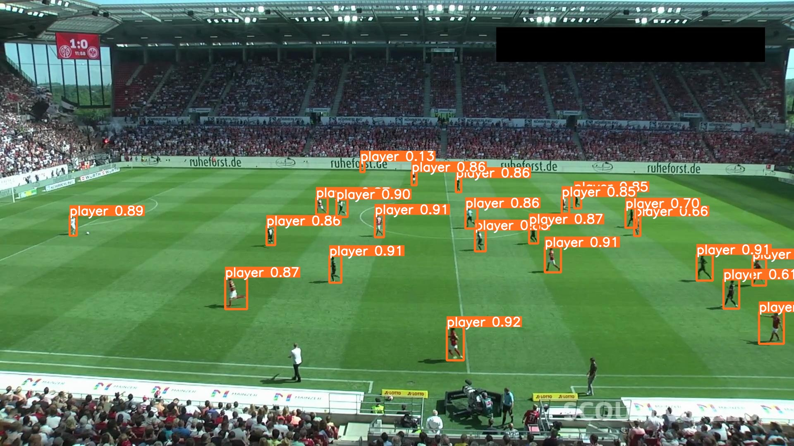
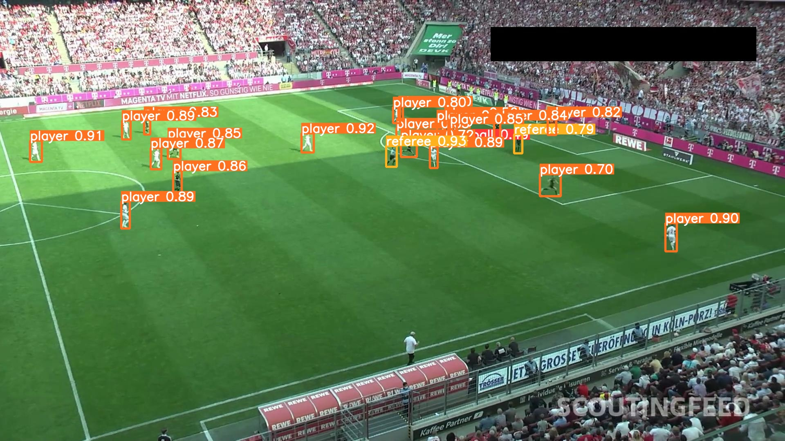

# Detector-Jogador-futebol

# Detector de Jogadores de Futebol

Este notebook tem como objetivo demonstrar o uso do YOLOv9 para detecção de objetos, com foco na detecção de jogadores de futebol. O conteúdo deste notebook é baseado em um vídeo do YouTube disponível em [Assistir vídeo](https://www.youtube.com/watch?v=XHT2c8jT3Bc).

## Dataset de treinamento

O conjunto de dados foi baixado do Roboflow Universe. O código faz uso da biblioteca `roboflow` para autenticação no Roboflow Universe e, em seguida, baixa o conjunto de dados específico selecionado dentro do diretório local do projeto. O conjunto de dados escolhido para este notebook é denominado "football-players-detection-3zvbc" e foi obtido do Roboflow Universe.

## Resultados Obtidos

Por fim, o modelo personalizado foi utilizado para realizar a detecção de jogadores de futebol em um conjunto de dados de teste. Os resultados da inferência podem ser visualizados nas seguintes imagens:

